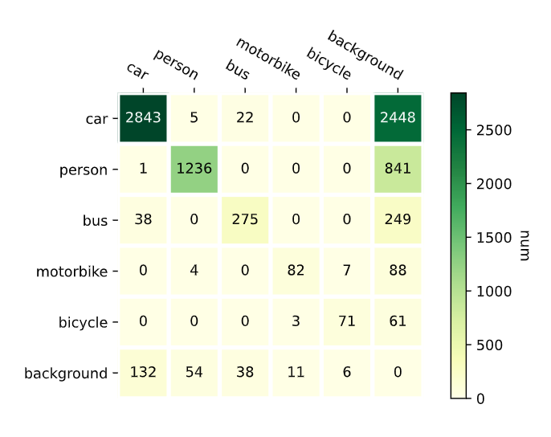
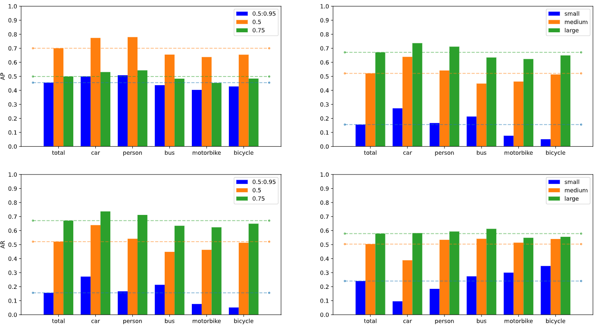

# CocoEvalPlus

A high-level encapsulation for evaluating detection on the Microsoft COCO dataset. It's based on pycocotools.cocoeval.
## Features

1. confusion matrix
2. every category metrics (ap ar)
3. summary metrics (map mar)
4. visualization utils

## Intuitive Results

## Example of usage

All examples are shown in [Test.ipynb](https://github.com/Luoofan/CocoEvalPlus/blob/main/Test.ipynb)

## References

- https://github.com/svpino/tf_object_detection_cm/blob/master/confusion_matrix.py
- https://github.com/cocodataset/cocoapi/pull/282
- https://www.osgeo.cn/matplotlib/gallery/images_contours_and_fields/image_annotated_heatmap.html